# Delivery Impact Estimate

This page is an **engineering-delivery heuristic**, not a benchmark or a model-quality claim. It estimates how much this skill improves software delivery discipline by adding persistent state recovery, small validated loops, test-first repair behavior, handoff artifacts, and release-oriented completion criteria.

## Heuristic comparison

```mermaid
xychart-beta
    title "Delivery Capability Index (Heuristic)"
    x-axis ["Continuity","State Recovery","Validation Loop","Regression Repair","Handoff Quality","Release Readiness"]
    y-axis "Score" 0 --> 100
    bar [40, 28, 45, 48, 32, 38]
    bar [84, 90, 91, 88, 86, 82]
```

## Interpretation

- Baseline = a capable general coding agent without this specialized long-running delivery workflow.
- With skill = the same underlying model operating under the skill's strict execution rules.
- The uplift comes from process structure, not from changing the model's raw intelligence.

## Estimated uplift by dimension

| Dimension | Without skill | With skill | Estimated uplift |
| --- | ---: | ---: | ---: |
| Continuity without asking “continue” every step | 40 | 84 | +110% |
| Cross-context recovery from files | 28 | 90 | +221% |
| Small validated implementation loops | 45 | 91 | +102% |
| Failure-first repair and regression discipline | 48 | 88 | +83% |
| Handoff and maintainability readiness | 32 | 86 | +169% |
| Packaging / release readiness | 38 | 82 | +116% |

## Practical takeaway

The biggest gains are usually not “better code generation” in isolation. The biggest gains are:

- less context loss across long-running work
- fewer false-complete states
- faster recovery after breakage
- more complete delivery artifacts
- much better takeover quality for the next engineer or agent
