# 交付能力提升评估

这份说明是一个**工程交付能力启发式评估**，不是官方 benchmark，也不是模型智力测试。它评估的是：当代理引入持久化状态恢复、单功能小闭环、先测后修、交接文档和发布导向完成标准后，软件交付能力会提升多少。

## 启发式对比图

```mermaid
xychart-beta
    title "工程交付能力指数（启发式）"
    x-axis ["连续推进","状态恢复","验证闭环","回归修复","交接质量","发布就绪"]
    y-axis "分数" 0 --> 100
    bar [40, 28, 45, 48, 32, 38]
    bar [84, 90, 91, 88, 86, 82]
```

## 这个图怎么理解

- “未使用技能” = 一个普通但合格的通用编码代理，没有这套长期运行交付机制。
- “使用技能后” = 同一个底层模型，在这个技能的强约束执行规则下工作。
- 提升主要来自流程和工程纪律，不是模型本身突然变聪明。

## 各维度提升估计

| 维度 | 未使用技能 | 使用技能后 | 估计提升 |
| --- | ---: | ---: | ---: |
| 不频繁停下来问“要不要继续” | 40 | 84 | +110% |
| 跨上下文依赖文件恢复状态 | 28 | 90 | +221% |
| 小闭环实现后立刻验证 | 45 | 91 | +102% |
| 失败优先修复与回归验证 | 48 | 88 | +83% |
| 可交接、可维护程度 | 32 | 86 | +169% |
| 打包 / 发布准备度 | 38 | 82 | +116% |

## 实战含义

最大的收益通常不是“单次写代码更快”，而是：

- 长时运行时更不容易丢上下文
- 更少出现“看起来完成了，其实没验证”的假完成
- 环境损坏或测试失败后恢复更快
- 最终交付物更完整
- 下一个工程师或下一个代理接手时成本更低
